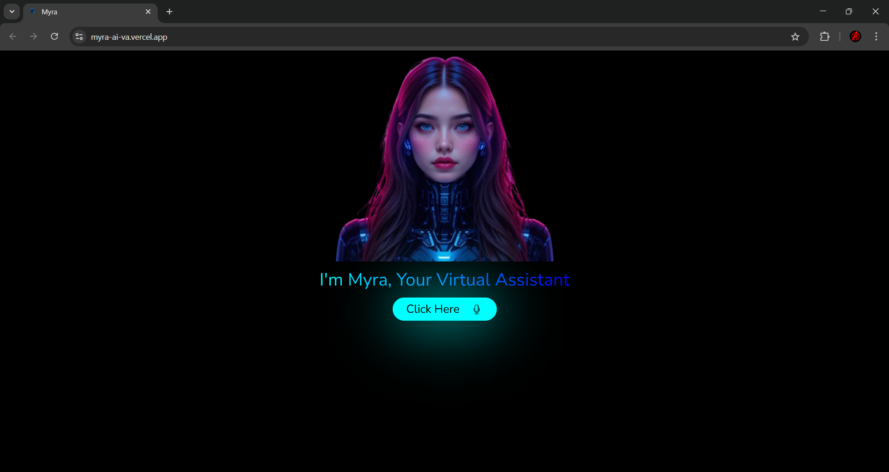

# 🤖 Myra — AI Voice Assistant

**A sleek, voice-powered virtual assistant built with React and Google Gemini AI**

<p align="center">
  
</p>

---

## ✨ Overview

**Myra** is a browser-based AI voice assistant that listens to your voice commands, understands them using Google's Gemini AI, and responds with spoken audio. It can handle everyday tasks — opening websites, telling the time and date, and answering any question using the power of generative AI.

---

## 🎯 Features

| Feature                     | Description                                                                |
| --------------------------- | -------------------------------------------------------------------------- |
| 🎙️ **Voice Recognition**    | Uses the Web Speech API to capture and transcribe your speech in real time |
| 🧠 **AI-Powered Responses** | Falls back to Google Gemini 2.5 Flash Lite for intelligent answers         |
| 🔊 **Text-to-Speech**       | Speaks responses aloud using the browser's Speech Synthesis API            |
| 🌐 **Open Websites**        | Voice commands to open YouTube, Google, and more                           |
| 🕐 **Time & Date**          | Instantly tells you the current time or date on request                    |
| ⚡ **Blazing Fast**         | Powered by Vite for near-instant dev startup and hot module replacement    |

---

## 🗣️ Supported Voice Commands

```
"Open YouTube"        → Opens YouTube in a new tab
"Open Google"         → Opens Google in a new tab
"What's the time?"    → Tells the current time
"What's the date?"    → Tells the current date
"<Anything else>"     → Answered intelligently by Gemini AI
```

---

## 🛠️ Tech Stack

- **[React 19](https://react.dev/)** — UI framework with Hooks & Context API
- **[Vite 8](https://vite.dev/)** — Lightning-fast build tool
- **[Google Generative AI SDK](https://ai.google.dev/)** — Gemini 2.5 Flash Lite model
- **[Web Speech API](https://developer.mozilla.org/en-US/docs/Web/API/Web_Speech_API)** — `SpeechRecognition` & `SpeechSynthesis` (browser native)
- **[React Icons](https://react-icons.github.io/react-icons/)** — Icon library

---

## 🚀 Getting Started

### Prerequisites

- [Node.js](https://nodejs.org/) (v18 or higher)
- A **Google Gemini API Key** — get one free at [Google AI Studio](https://aistudio.google.com/apikey)
- A Chromium-based browser (Chrome/Edge) for full Web Speech API support

### 1. Clone the Repository

```bash
git clone https://github.com/your-username/myra.git
cd myra
```

### 2. Install Dependencies

```bash
npm install
```

### 3. Set Up Environment Variables

Create a `.env` file in the project root:

```env
VITE_GEMINI_API_KEY=your_gemini_api_key_here
```

> ⚠️ **Never commit your `.env` file.** It is already listed in `.gitignore`.

### 4. Start the Development Server

```bash
npm run dev
```

Then open your browser at **`http://localhost:5173`**

---

## 📁 Project Structure

```
Myra/
├── public/                 # Static assets
├── src/
│   ├── assets/             # Images and GIFs (ai.png, speak.gif, voice.gif)
│   ├── context/
│   │   └── UserContext.jsx # Global state, speech recognition & command logic
│   ├── App.jsx             # Main UI component
│   ├── App.css             # Component styles
│   ├── gemini.js           # Google Gemini AI integration
│   ├── index.css           # Global styles
│   └── main.jsx            # App entry point
├── .env                    # API keys (not committed)
├── .gitignore
├── index.html
├── package.json
└── vite.config.js
```

---

## 📜 Available Scripts

| Command           | Description                          |
| ----------------- | ------------------------------------ |
| `npm run dev`     | Start the local development server   |
| `npm run build`   | Build the app for production         |
| `npm run preview` | Preview the production build locally |
| `npm run lint`    | Run ESLint to check code quality     |

---

## 🔒 Environment Variables

| Variable              | Required | Description                |
| --------------------- | -------- | -------------------------- |
| `VITE_GEMINI_API_KEY` | ✅ Yes   | Your Google Gemini API key |

---

## 🌐 Browser Compatibility

Myra relies on the **Web Speech API**, which is best supported in Chromium-based browsers.

| Browser           | Voice Recognition | Text-to-Speech |
| ----------------- | ----------------- | -------------- |
| ✅ Google Chrome  | Supported         | Supported      |
| ✅ Microsoft Edge | Supported         | Supported      |
| ⚠️ Firefox        | Limited           | Supported      |
| ❌ Safari         | Not Supported     | Supported      |
