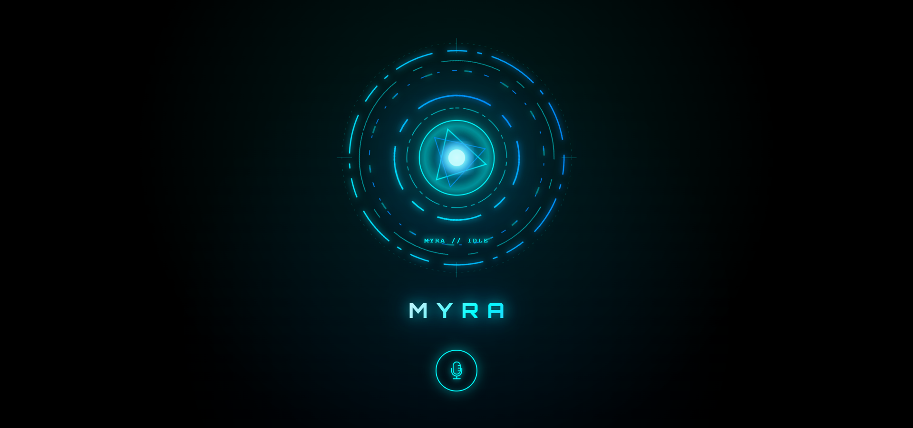

# 🤖 Myra — AI Voice Assistant

**A sleek, voice-powered virtual assistant built with React 19, Vite 8, and Google Gemini AI**

<p align="center">
  
</p>

---

## ✨ Overview

**Myra** is an interactive, browser-based AI voice assistant featuring a high-tech Sci-Fi Reactor Core HUD avatar. Powered by the official `@google/genai` SDK and Google's **Gemini 3.5 Flash** model, Myra listens to voice commands, understands user intent, and responds in natural spoken audio.

Whether you need quick web navigation, real-time date/time updates, or conversational generative AI responses, Myra offers a fast, fluid, and visually stunning experience.

---

## 🎯 Key Features

- 🎙️ **Voice Recognition**: Real-time speech-to-text using the Web Speech API with automatic locale detection.
- 🧠 **Gemini 3.5 Flash AI Engine**: Integrated with `@google/genai` for short, concise, and natural spoken answers.
- 🔊 **Dynamic Text-to-Speech**: Converts responses to spoken audio with automatic SpeechSynthesis voice selection and Markdown cleanup.
- ⚛️ **Futuristic Sci-Fi HUD Avatar**: Dynamic vector SVG HUD featuring dual rotating ring indicators, sound spectrum visualizers, reactor core glow, and live state updates (`MYRA // IDLE`, `MYRA // LISTENING...`, `MYRA // SPEAKING`).
- 🌐 **Web Navigation**: Voice commands to open YouTube, Google, and Nexa instantly in new tabs.
- 🕐 **Time & Date Queries**: Rapid voice access to local time and current date.
- 👤 **Persona & Creator Awareness**: Recognizes her identity (Myra) and creator (Aniruddha).
- ⚡ **Modern Stack**: Built with React 19 and Vite 8 for fast dev setup and performance.

---

## 🗣️ Supported Voice Commands

| Command | Action |
| :--- | :--- |
| `"Open YouTube"` | Opens YouTube in a new tab |
| `"Open Google"` | Opens Google search in a new tab |
| `"Open Nexa"` | Opens Nexa platform in a new tab |
| `"What's the time?"` | Speaks and displays the current time |
| `"What's the date?"` | Speaks and displays today's date |
| `"What is your name?"` | Introduces herself as Myra |
| `"Who created you?"` | Identifies her creator (Aniruddha) |
| *`<Any question or prompt>`* | Contextually answered by Google Gemini 3.5 Flash |

---

## 🛠️ Tech Stack

### 🎨 Frontend & UI

| Category | Technology |
| :--- | :--- |
| **Framework** | React 19 |
| **Build Tool** | Vite 8 |
| **Styling** | CSS3 (Cyberpunk Glassmorphism & SVG Animations) |
| **UI Components** | React Icons (`react-icons`) |

### 🌐 Integrations & Web APIs

| Category | Technology |
| :--- | :--- |
| **AI SDK** | `@google/genai` (^1.48.0) |
| **AI Model** | Google Gemini 3.5 Flash |
| **Voice Engines** | Web Speech API (`SpeechRecognition` & `SpeechSynthesis`) |

---

## 📁 Project Structure

```
Myra/
├── assets/                  # Project screenshot assets
└── Myra/
    ├── public/              # Static assets
    ├── src/
    │   ├── assets/          # Logos & branding images
    │   ├── components/
    │   │   └── MyraAvatar.jsx # Animated Sci-Fi HUD Reactor avatar
    │   ├── context/
    │   │   └── UserContext.jsx # Global voice recognition, TTS & command handler logic
    │   ├── App.css          # Cyberpunk glassmorphism & HUD styles
    │   ├── App.jsx          # Main UI layout & mic trigger
    │   ├── gemini.js        # Google GenAI SDK integration (@google/genai)
    │   ├── index.css        # Base global styles
    │   └── main.jsx         # React application entry point
    ├── .env                 # API Keys (Git-ignored)
    ├── index.html
    ├── package.json
    └── vite.config.js
```

---

## 🌐 Browser Compatibility

Myra relies on the **Web Speech API**, which works best in Chromium-based browsers.

| Browser | Voice Recognition (STT) | Text-to-Speech (TTS) |
| :--- | :---: | :---: |
| ✅ **Google Chrome** | Supported | Supported |
| ✅ **Microsoft Edge** | Supported | Supported |
| ⚠️ **Firefox** | Limited / Config required | Supported |
| ❌ **Safari** | Not Supported | Supported |


